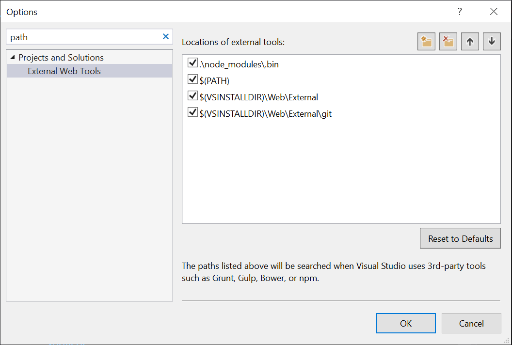
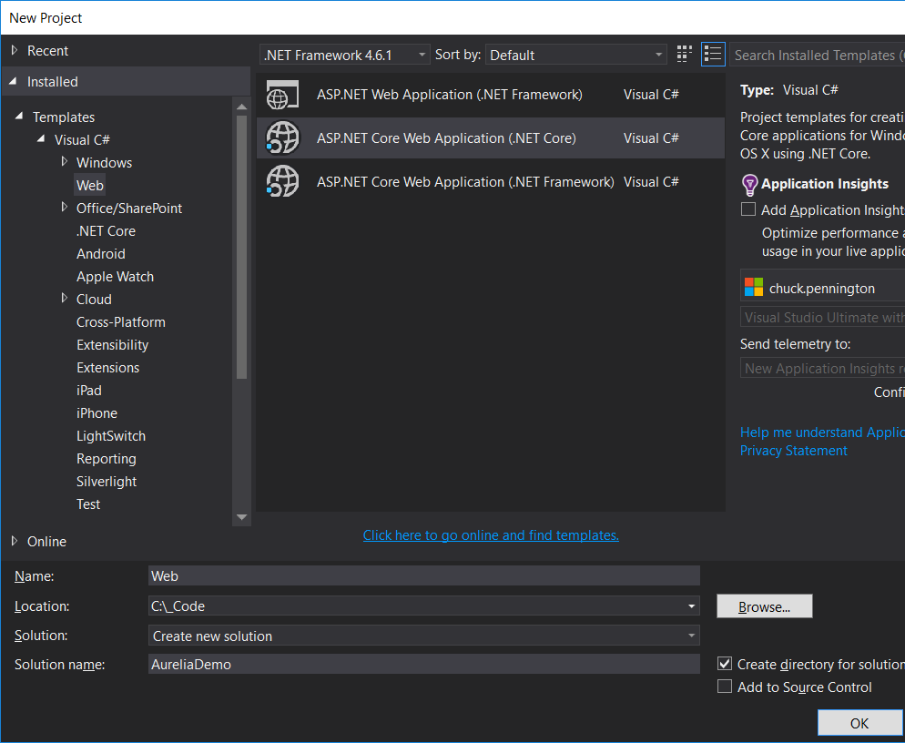
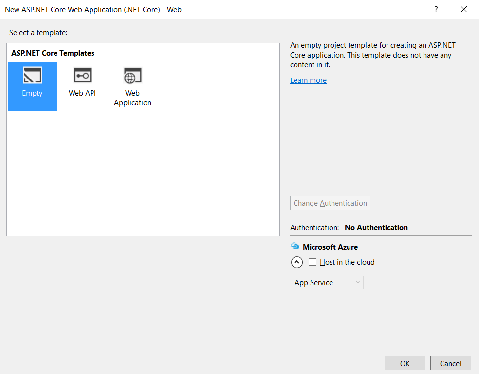
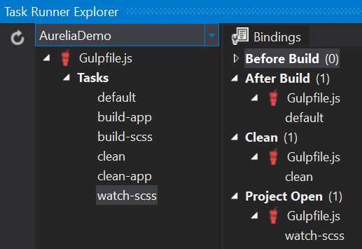

# Create an Aurelia Typescript startup project in Visual Studio 2015
This blog will step you through creating a startup project from scratch that supports ASP<i></i>.NET 5 .NET 
Core with MVC, Web API, Typescript, Aurelia, and Bootstrap navigation.


## Setup your development environment
- If don't already have Node, install Node.<i></i>js: https://nodejs.org/
- If you have previously installed a version of gulp globally, run this command from the command prompt to remove it so an older version doesn't collide with gulp-cli:
```
	npm rm --global gulp
```
- Run this command from the command prompt to install gulp-cli:
```
	npm install gulp-cli -g
```
- Run this command to install jspm:
```
	npm install jspm -g
```

## Create a new web project in Visual Studio
- Open Visual Studio and go to Tools - Options - Projects and Solutions - External Web Tools to move $(PATH) up above $(VSINSTALLDIR) paths so the latest version of node and npm will be used.

	

- Create a new web project:
	- File - New - Project
	- From the New Project dialog, under Visual C# - Web:
		- Select Template: ASP.<i></i>NET Core Web Application (.NET Core)
		- Enter a name for the project, i.e. AureliaDemo
		- Enter a name for the solution, i.e. AureliaDemo
		- Click OK

		

	- Select the Empty template on the New ASP.<i></i>NET Core Web Application dialog and click OK.

		

- Open a command prompt in the project folder (AureliaDemo/src/AureliaDemo).
- Run command `npm init` to create the package.json file and enter answers for these questions:
	- name: `aureliademo`
	- version: `0.0.1`
	- description: `A startup demo for Aurelia`
	- entry point: (leave as index.js and press enter)
	- test command: (just press enter)
	- git repository: (just press enter)
	- keywords: (just press enter)
	- author: (enter your name and press enter)
	- license: (just press enter)
	- Press enter for Is this ok?
- Install these node packages locally by running these commands:
```
	npm install gulp --save-dev
	npm install jspm --save-dev
```
- Run command `jspm init` to initialize jspm. Enter answers for these questions:
	- Would you like jspm to prefix the jspm package.json properties under jspm? (just press enter to answer yes)
	- Enter server baseURL: `./wwwroot`
	- Enter jspm packages folder: (just press enter to keep default of wwwwroot\jspm_packages)
    - Enter config file path: (just press enter to keep default of wwwroot\config<i></i>.js)
    - Press enter to confirm the creation of wwwroot\config<i></i>.js.
	- Enter client baseURL: (just press enter to keep default of /)
	- Do you wish to use a transpiler? `no`
- Install these jspm packages by running these commands:
```
	jspm install jquery
	jspm install bootstrap
```
- Show all files in the project and right-click on package.json and choose Show in Solution Explorer.
- The package.json file will look like:
```
	{
		"name": "aureliademo",
		"version": "0.0.1",
		"description": "A startup demo for Aurelia",
		"main": "index.js",
		"scripts": {
			"test": "echo \"Error: no test specified\" && exit 1"
		},
		"author": "Chuck Pennington",
		"license": "ISC",
		"devDependencies": {
			"gulp": "^3.9.1",
			"jspm": "^0.16.39"
		},
		"jspm": {
			"directories": {
				"baseURL": "wwwroot"
			},
			"dependencies": {
				"bootstrap": "github:twbs/bootstrap@^3.3.6",
				"jquery": "npm:jquery@^3.0.0"
			},
			"devDependencies": {}
		}
	}
```

## Add Static Files
- Edit project.json and add a dependency for `"Microsoft.AspNetCore.StaticFiles": "1.0.0-rc2-final"`
- Save changes to project.json so the references will be added.
- Edit Startup<i></i>.cs and comment out the "Hello World" response and add `app.UseStaticFiles();` to the Configure method:
```
	public void Configure(IApplicationBuilder app)
	{
		//app.Run(async (context) =>
		//{
		//    await context.Response.WriteAsync("Hello World!");
		//});

		app.UseStaticFiles();
	}
```
- Add a new static html file named hello.html to the wwwroot folder with the following content:
```
	<!DOCTYPE html>
	<html>
	<head>
		<meta charset="utf-8" />
		<title>Aurelia Demo</title>
	</head>
	<body>
		<h1>Hello Static Files!</h1>
	</body>
	</html>
```
- Right-click the hello.html file in the Solution Explorer and choose View in Browser. The hello.html page should be displayed.
- You can delete the hello.html file since it will no longer be used.


## Add MVC
- Edit project.json and add a dependency for `"Microsoft.AspNetCore.Mvc": "1.0.0-rc2-final"`
- Save changes to project.json so the references will be added.
- Edit Startup<i></i>.cs and add `services.AddMvc();` to the ConfigureServices method and add the following block of code to the Configure method.
```
	app.UseMvc(routes =>
	{
		routes.MapRoute(
		name: "default",  
		template: "{controller=Home}/{action=Index}/{id?}");  
	});
```
- Add a new folder named Controllers to the project.
- Add a new item to the Controllers folder and on the Add New Item dialog window choose MVC Controller Class and name it HomeController<i></i>.cs
- Add a new folder named Views to the project.
- Add a new item to the Views folder and on the Add New Item dialog window choose MVC View Start Page and name it _ViewStart.cshtml
- Add a new folder named Shared to the Views folder.
- Add a new item to the Shared folder and on the Add New Item dialog window choose MVC View Layout Page and name it _Layout.cshtml
- Add a new folder named Home to the Views folder.
- Add a new item to the Home folder and on the Add New Item dialog window choose MVC View Page and name it Index.cshtml and change the content to the following code:
```
	@{
		ViewBag.Title = "Aurelia Demo";
	}
	<h1>Hello MVC</h1>
```
- Start/Run the project and "Hello MVC" should be displayed in the browser.


## Add a simple Aurelia application
- Run these commands to add Aurelia to the project:
```
	jspm install aurelia-framework
	jspm install aurelia-bootstrapper
```
- Modify index.cshtml to bootstrap aurelia:
```
	<div aurelia-app>
		<h1>Loading...</h1>
	</div>

	<script src="~/jspm_packages/system.js"></script>
	<script src="~/config.js"></script>
	<script>
		System.import('aurelia-bootstrapper');
	</script>
```
- Add a new folder to the project named app that will contain all the Aurelia components. The name of this folder can be anything you want.
- Add a new typescript file named app<i></i>.ts in the app folder with the following content. When this file is saved, visual studio should compile it and create an app<i></i>.js file.
```
	export class App {
		public message:string;

		public App() {
			this.message = "";
		}

		public activate() {
			this.message = 'Hello Aurelia';
		}
	}
```
- Add a new html file named app.html in the app folder with the following content.
```
	<template>
    		<div class="demo-message">${message}</div>
	</template>
```
- Now that we have a very minimal Aurelia app, we need to setup gulp tasks to copy the content to the wwwroot folder so the application will run.


## Setup gulp tasks to copy the Aurelia content to wwwroot
- Add a new item to the project, choose Gulp Configuration file and name it gulpfile<i></i>.js with the following content:
```
	/// <binding AfterBuild='default' Clean='clean' />
	"use strict";

	var gulp = require("gulp");
	var del = require("del");

	var webroot = "./wwwroot/";
	var approot = "./app/";

	var paths = {
		app: approot + "**/*.{js,html,css}",
		output: webroot + "app"
	};

	gulp.task("clean-app", function () {
		return del(paths.output);
	});

	gulp.task("clean", ["clean-app"]);

	gulp.task("build-app", function () {
		return gulp.src(paths.app)
			.pipe(gulp.dest(paths.output));
	});

	gulp.task("default", ["build-app"]);
```
- Run command: `npm install del --save-dev`
- Open the Task Runner Explorer in Visual Studio and verify that the default task is bound to the After Build event and the clean task is bound to the Clean event.
- Modify config<i></i>.js and add the following line to the paths property. This tells the aurelia bootstrapper to look for all files in the app folder.
```
	"*": "app/*"
```
- Build the solution/project and the app/app.js and app/app.html files should be copied to the wwwroot/app folder.
- Run/Start the project and Hello Aurelia should be displayed in the browser.

## Add Sass
- Run command: `npm install gulp-sass --save-dev`
- Add the following declaration to gulpfile<i></i>.js:
```
	var sass = require("gulp-sass");
```
- Add the following properties to the paths variable in gulpfile<i></i>.js:
```
	scss: approot + "**/*.scss",
	css: webroot + "css"
```
- Add the following tasks to gulpfile<i></i>.js:
```
	gulp.task("build-scss", function () {
		return gulp.src(paths.scss)
			.pipe(sass({ outputStyle: 'compressed' }))
			.pipe(gulp.dest(paths.output));
	});

	gulp.task("watch-scss", function () {
		return gulp.watch(paths.scss, ["build-scss"]);
	});

	gulp.task("default", ["build-app", "build-scss"]);
```
- Change the bindings on the first line of gulpfile<i></i>.js to:
```
	/// <binding AfterBuild='default' Clean='clean' ProjectOpened='watch-scss' />
```
- Refresh the Task Runner Explorer and verify there are 3 tasks that are bound correctly.

	

- The next time the solution is opened, the task runner will automatically start the watch-scss task and any changes to scss files will automatically be copied to the output (wwwroot) folder. If you don't want to reopen the solution, you can just double-click the watch-scss task and it will start up and stay running.
- Right-click on the app folder and Add New Item - SCSS Style Sheet (SASS) named site.scss with the following content:
```
	body {
		margin: 0;
	}

	.demo-message {
    	font-size: 18px;
		color: green;
	}
```
- Add the following line to the head element in Views/Shared/_Layout.cshtml:
```
	<link rel="stylesheet" href="~/app/site.css" />
```
- Build and run the project and verify that the message is now green.


## Add Bootstrap and navigation
- Run command: `jspm install font-awesome`
- Add a new html file to the app folder named nav-bar.html with the following content:
```
	<template bindable="router">
		<nav class="navbar navbar-default navbar-fixed-top" role="navigation">
			<div class="navbar-header">
				<button type="button" class="navbar-toggle" data-toggle="collapse" data-target="#bs-example-navbar-collapse-1">
					<span class="sr-only">Toggle Navigation</span>
					<span class="icon-bar"></span>
					<span class="icon-bar"></span>
					<span class="icon-bar"></span>
				</button>
				<a class="navbar-brand" href="#">
					<i class="fa fa-home"></i>
					<span>${router.title}</span>
				</a>
			</div>

			<div class="collapse navbar-collapse" id="bs-example-navbar-collapse-1">
				<ul class="nav navbar-nav">
					<li repeat.for="row of router.navigation" class="${row.isActive ? 'active' : ''}">
						<a data-toggle="collapse" data-target="#bs-example-navbar-collapse-1.in" href.bind="row.href">${row.title}</a>
					</li>
				</ul>

				<ul class="nav navbar-nav navbar-right">
					<li class="loader" if.bind="router.isNavigating">
						<i class="fa fa-spinner fa-spin fa-2x"></i>
					</li>
				</ul>
			</div>
		</nav>
	</template>
```
- Modify app.html to have the following content:
```
	<template>
		<require from="nav-bar.html"></require>
		<require from="bootstrap/css/bootstrap.css"></require>
		<nav-bar router.bind="router"></nav-bar>
		<div class="page-host">
			<router-view></router-view>
		</div>
	</template>
```
- Modify app<i></i>.ts the have the following content:
```
	import {Router, RouterConfiguration} from 'aurelia-router'

	export class App {
		router: Router;

		configureRouter(config: RouterConfiguration, router: Router) {
			config.title = 'Aurelia Demo';
			config.map([
				{ route: ['', 'home'], name: 'home', moduleId: 'home', nav: true, title: 'Home' },
				{ route: 'users', name: 'users', moduleId: 'users', nav: true, title: 'Github Users' }
			]);

			this.router = router;
		}
	}
```
- Add a new html file named home.html to the app folder with the following content:
```
	<template>
    	<div class="page">
			<div class="well">
				<h2>${heading}</h2>
			</div>
		</div>
	</template>
```
- Add a new typescript file named home<i></i>.ts to the app folder with the following content:
```
	export class Home {
		heading = "Home";
	}
```
- Add a new html file named users.html to the app folder with the following content:
```
	<template>
    	<div class="page">
			<h2>${heading}</h2>
        </div>
	</template>
```
- Add a new typescript file named users<i></i>.ts to the app folder with the following content:
```
	export class Users {
		heading = "Github Users";
	}
```
- Modify the site.scss file to have the following content:
```
	body {
		margin: 0;
	}

	.page-host {
		position: absolute;
		left: 0;
		right: 0;
		top: 50px;
		bottom: 0;
		overflow-x: hidden;
		overflow-y: auto;

		& .page {
			padding: 10px 10px 0 10px;
		}
	}
```
- Build and run the project to view the bootstrap navigation.
- Even though the project still builds and runs, a typescript error may exist that states: Cannot find module 'aurelia-router' in the app<i></i>.ts file. To fix this error we need to add typings for typescript.


## Add Typescript Typings
- Make sure you have the latest version of typings install by running the following command: `npm install -g typings`
- Add a New Item to the project, choose JSON file and name it typings.json and then change the content to the following:
```
	{
		"name": "aurelia-demo",
		"dependencies": {
		"aurelia-binding": "github:aurelia/binding",
		"aurelia-bootstrapper": "github:aurelia/bootstrapper",
		"aurelia-dependency-injection": "github:aurelia/dependency-injection",
		"aurelia-event-aggregator": "github:aurelia/event-aggregator",
		"aurelia-fetch-client": "github:aurelia/fetch-client",
		"aurelia-framework": "github:aurelia/framework",
		"aurelia-history": "github:aurelia/history",
		"aurelia-history-browser": "github:aurelia/history-browser",
		"aurelia-loader": "github:aurelia/loader",
		"aurelia-logging": "github:aurelia/logging",
		"aurelia-logging-console": "github:aurelia/logging-console",
		"aurelia-metadata": "github:aurelia/metadata",
		"aurelia-pal": "github:aurelia/pal",
		"aurelia-pal-browser": "github:aurelia/pal-browser",
		"aurelia-path": "github:aurelia/path",
		"aurelia-polyfills": "github:aurelia/polyfills",
		"aurelia-route-recognizer": "github:aurelia/route-recognizer",
		"aurelia-router": "github:aurelia/router",
		"aurelia-task-queue": "github:aurelia/task-queue",
		"aurelia-templating": "github:aurelia/templating",
		"aurelia-templating-binding": "github:aurelia/templating-binding",
		"aurelia-templating-resources": "github:aurelia/templating-resources",
		"aurelia-templating-router": "github:aurelia/templating-router"
	},
		"globalDevDependencies": {
			"fetch": "github:aurelia/fetch-client/doc/whatwg-fetch.d.ts",
			"es6-collections": "registry:dt/es6-collections#0.5.1+20160316155526",
			"es6-promise": "github:DefinitelyTyped/DefinitelyTyped/es6-promise/es6-promise.d.ts#24e12a7af994afa2226af70fbfae0adc78736a9e",
			"jquery": "registry:dt/jquery#1.10.0+20160417213236"
		}
	}
```
- Run command `typings install`
- A new typings folder should exist that contains all the d<i></i>.ts files that typescript needs.
- Add New Item to the project, choose Typescript JSON Configuration File and keep the name of tsconfig.json and change the content to the following:
```
	{
		"compilerOptions": {
			"noImplicitAny": false,
			"noEmitOnError": true,
			"removeComments": false,
			"sourceMap": true,
			"target": "es5",
			"emitDecoratorMetadata": true,
			"experimentalDecorators": true
		},
		"exclude": [
			"node_modules",
			"wwwroot"
		]
	}
```
- Rebuild the solution and now all typescript errors should be gone.


## Add HTTP requests and Dependency Injection
- Run command: `jspm install fetch`
- Run command; `jspm install aurelia-fetch-client`
- Update the users.html file to the following content:
```
	<template>
		<section class="page">
			<h2>${heading}</h2>
			<div class="row">
				<div class="col-sm-6 col-md-3" repeat.for="user of users">
					<div>
						<div>
							
						</div>
						<div>
							<p>${user.login}</p>
							<p><a target="_blank" class="btn btn-default" href.bind="user.html_url">Contact</a></p>
						</div>
					</div>
				</div>
			</div>
		</section>
	</template>
```
- Update the users.ts file to the following content:
```
	import {autoinject} from 'aurelia-framework';
	import {HttpClient} from 'aurelia-fetch-client';
	import 'fetch';

	@autoinject
	export class Users {
		heading: string = 'Github Users';
		users: any[] = [];

		constructor(private http: HttpClient) {
			http.configure(config => {
				config
					.useStandardConfiguration()
					.withBaseUrl('https://api.github.com/');
			});
		}

		activate() {
			return this.http.fetch('users')
				.then(response => response.json())
				.then(users => this.users = users);
		}
	}
```
- Build and run the project, go to the Github Users page and a list of github users should be retrieved and displayed on the page.

 
## Add Web API
- Add a new Class Library (.NET Core) project to the solution, in the src folder, named Models. This project will contain all the common Models classes and will be available to other projects if more are added later.
- Rename the Class1<i></i>.cs file to User<i></i>.cs. Let Visual Studio also rename the class or manually rename the class to User.
- Modify User<i></i>.cs to contain the following content:
```
	public class User
	{
		public int UserId { get; set; }
		public string UserName { get; set; }
		public string FirstName { get; set; }
		public string LastName { get; set; }
	}
```
- Add Reference to the web project and choose the Models project.
- Add New Item to the web project's Controllers folder, choose Web API Controller Class, and name it UsersController<i></i>.cs.
- Modify the Get() method to contain the following:
```
	[HttpGet]
	public IActionResult Get()
	{
		var users = new[]
		{
			new Models.User { UserId = 1, UserName = "dan", FirstName = "Dan", LastName = "Wilson" },
			new Models.User { UserId = 2, UserName = "tom", FirstName = "Tom", LastName = "Jones" },
			new Models.User { UserId = 3, UserName = "joe", FirstName = "Joe", LastName = "Smith" }
		};

		return Ok(users);
	}
```
- Modify the ConfigureServices method in Startup<i></i>.cs to return Camel Case JSON. You will also need to add a using statement `using Newtonsoft.Json.Serialization;`
```
	public void ConfigureServices(IServiceCollection services)
	{
		services.AddMvc()
			.AddJsonOptions(a => a.SerializerSettings.ContractResolver = new CamelCasePropertyNamesContractResolver());
	}
```
- Build and run the web project and browse to /api/Users to see the json returned from the Web API.
```
    [{"userId":1,"userName":"dan","firstName":"Dan","lastName":"Wilson"},{"userId":2,"userName":"tom","firstName":"Tom","lastName":"Jones"},{"userId":3,"userName":"joe","firstName":"Joe","lastName":"Smith"}]
```
